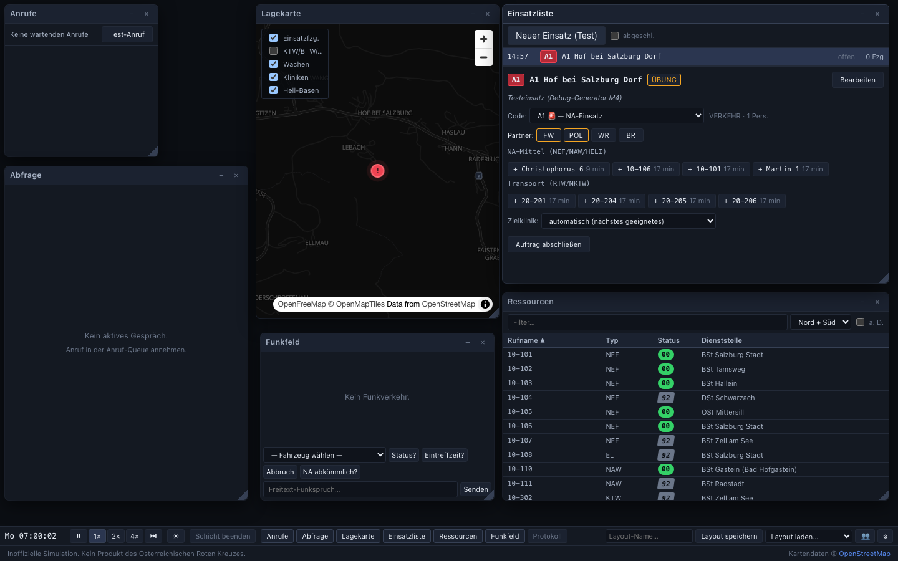
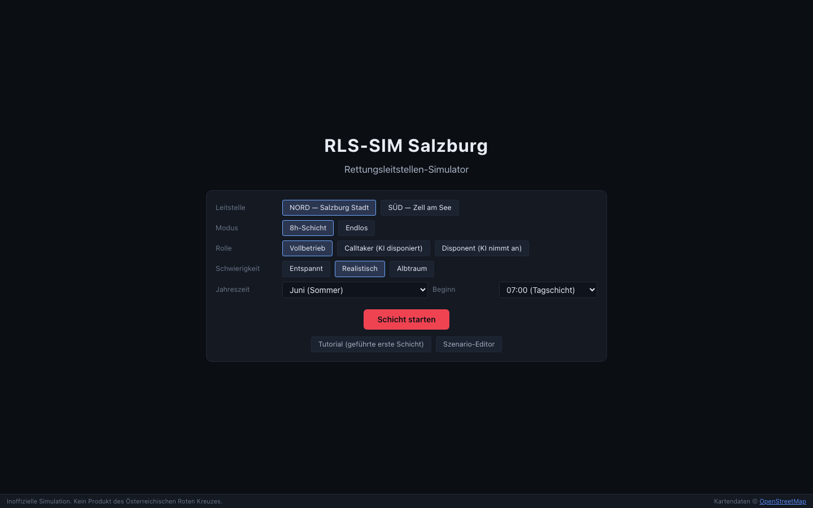
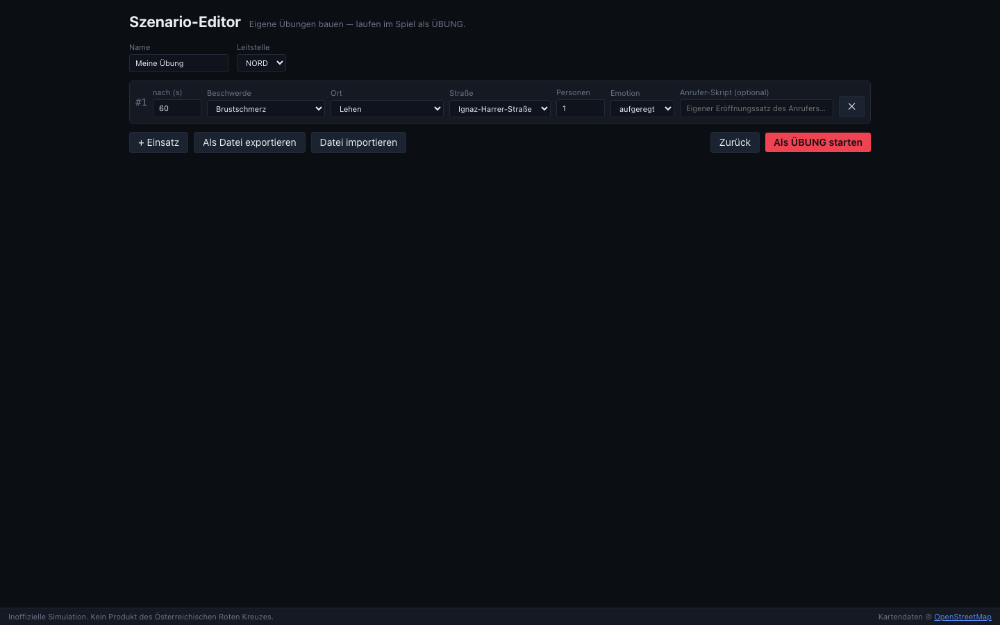

# RLS-SIM Salzburg

**Rettungsleitstellen-Simulator** — eine realitätsnahe Web-Simulation des Salzburger
Rettungsdienst-Leitstellenalltags. Du arbeitest als **Calltaker** (Notrufabfrage) und/oder
**Disponent** (Alarmierung & Einsatzführung) der Landesleitstelle — wahlweise Nord
(Salzburg Stadt) oder Süd (Zell am See).

> **Inoffizielle Simulation. Kein Produkt des Österreichischen Roten Kreuzes.**
> Fan-Projekt, angelehnt an reale Strukturen; Stichworte/Details teils rekonstruiert.



## Features

- **Echte Salzburg-Systematik:** offizielle Einsatzcodes (A1–E6, MANV1–4 inkl.
  Sondersignal-Logik), echtes Status-Schema (00→1→…→7→00, 88→08/09/10),
  Funkrufnamen (5.BD-TNN) und Funkprotokoll („X von Y" / „kommen" / „Verstanden").
- **156 Fahrzeuge + 5 Hubschrauber** mit Dienstzeiten (inkl. Eigenheiten wie der
  Hof-Regel: nachts + Wochenende), Vorhaltepositionen an LKH/UKH/CDK,
  Reservefahrzeugen und Heli-Regeln (nur Tageslicht, Saison, Wetter).
- **Standardisierte Notrufabfrage:** Frageschema mit Merkmalskette im ELS-Stil,
  24 Hauptbeschwerden, Anruf-Triage (Notruf vs. KT-Anmeldung vs. Irrläufer),
  Duplizitätsanrufe, **Ortungskaskade** (AML, Ortungs-SMS, Festnetzdaten,
  Netzbetreiber-Abfrage).
- **KI-Anrufer in 3 Stufen:** Dialogbaum (sofort spielbar, offline) · **WebLLM**
  (lokales LLM im Browser, einmaliger Download, danach offline) · eigener
  OpenAI-kompatibler Endpoint (z. B. Ollama). Plus TTS-Sprachausgabe.
- **Disposition:** AO-Vorschlag mit Übersteuern, freie Mittelwahl + Umdisponieren,
  Partner (FW/Polizei/Wasser-/Bergrettung) sichtbar auf der Karte, MANV-Eskalation,
  Hilfsfrist-Timer, Zielklinik-Wahl mit **Kapazitätsnachweis**
  („nächstes ≠ richtiges ≠ freies KH"), Einsatztagebuch je Auftrag.
- **Straßen-Routing:** Bodenfahrzeuge folgen dem echten Salzburger Straßennetz
  (OSM-Export + A*), Restrouten live auf der Karte — nur Hubschrauber fliegen
  Luftlinie. **Bereitstellungsraum & Lagefreigabe** bei Polizei-Lagen.
- **Bidirektionaler Funk:** statusgetriebene Meldungen, NA-Nachforderung → A4 per
  Klick, Sprechwünsche, aktives Anfunken mit Schnellphrasen & Freitext.
- **Outcome & Scoring:** Überleben hängt an Reaktionszeit, Notarzt und
  Telefonreanimation; hartes Debriefing; Schichtreport mit Note, Historie und
  Diagramm.
- **Fenster-Manager** wie im echten ELS: frei verschieb-/skalierbare Fenster,
  speicherbare Layout-Presets.
- **Coop für 2** (Calltaker + Disponent): PeerJS-Cloud, manueller WebRTC-Code oder
  lokal in zwei Fenstern — Host-authoritativ, gemeinsamer Schichtreport.
- **Szenario-Editor** für eigene Übungen (JSON-Export/-Import, läuft als ÜBUNG),
  zwei dezente Story-Arcs, Achievements, Sound-Mixer, geführtes Tutorial.
- **Leitstellen-Komfort:** Status-Lichterkette (gesamte Flotte auf einen Blick),
  Tastaturkürzel (Leertaste Pause, 1/2/3 Tempo, N Ereignis-Sprung, A Anruf
  annehmen, ? Übersicht).

## Schnellstart (Spielen)

| | |
|---|---|
|  |  |

1. **Tutorial starten** — die geführte erste Schicht erklärt Anruf → Abfrage →
   Auftrag → Disposition → Funk.
2. Danach: Leitstelle (Nord/Süd), Modus (8h-Schicht/Endlos), Rolle und
   Schwierigkeit wählen → **Schicht starten**.
3. Optional in ⚙ Einstellungen: KI-Anrufer (WebLLM) laden oder eigenen Endpoint
   verbinden, TTS aktivieren, Sound-Mixer.

Alles läuft **ohne Server, ohne Kosten, ohne Konto** im Browser
(Saves in IndexedDB).

## Entwicklung

```bash
npm install
npm run dev            # Dev-Server
npm run lint           # ESLint
npm run validate-data  # Zod-Validierung aller Spieldaten
npm test               # Vitest (141 Unit-Tests)
npm run build          # Production-Build
npm run smoke          # Playwright-E2E (26 Tests, baut + preview)
```

CI (GitHub Actions) führt Lint, Datenvalidierung, Unit-Tests, Build und
Smoke-Tests aus und deployt `main` auf GitHub Pages.

### Projektstruktur

- `src/data/` — Spieldaten (Codes, Kategorien, Status, Wachen, Flotte, Kliniken,
  Helis, Balancing, Orts-Index) mit Zod-Schemas; Quellen: `research/GAME_DATA.md`
- `src/engine/` — UI-freie Domänenlogik (Status-Lifecycle, Dienstzeiten, Routing,
  AO, KH-Matching, Szenario-Generator, Anrufer-Skript, Funkprotokoll, Outcome,
  Scoring) — vollständig unit-getestet
- `src/state/` — Zustand-Stores + Simulations-Loop
- `src/panels/`, `src/windows/` — Fenster-Engine + Spielfenster
- `src/llm/` — KI-Anrufer-Abstraktion (WebLLM-Worker, Endpoint, Mock)
- `src/coop/` — Coop-Transporte + Protokoll
- `ANNAHMEN.md` — protokollierte Annahmen · `BUILD_REPORT.md` — Logbuch je Meilenstein

### Tech-Stack

React 18 · Vite · TypeScript (strict) · Zustand · MapLibre GL JS + OSM ·
@mlc-ai/web-llm · Web Speech API · PeerJS/WebRTC · IndexedDB (idb) · Zod ·
Vitest · Playwright

## Lizenzen / Attribution

Kartendaten © [OpenStreetMap](https://www.openstreetmap.org/copyright)-Mitwirkende
(ODbL), Kartenstil [OpenFreeMap](https://openfreemap.org) / Raster-Fallback
© [CARTO](https://carto.com/attributions). MapLibre (BSD), WebLLM (Apache 2.0),
Llama 3.2 (Community License), PeerJS (MIT).

**Markenhinweis:** „Rotes Kreuz" (Name & Zeichen) ist gesetzlich geschützt; dieses
Projekt verwendet weder Logo noch Schutzzeichen und ist kein Produkt des
Österreichischen Roten Kreuzes.
